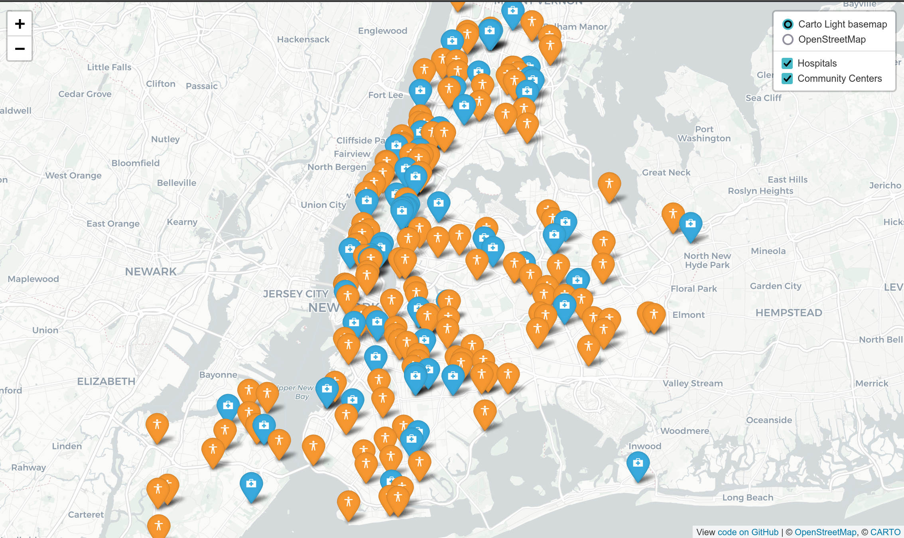
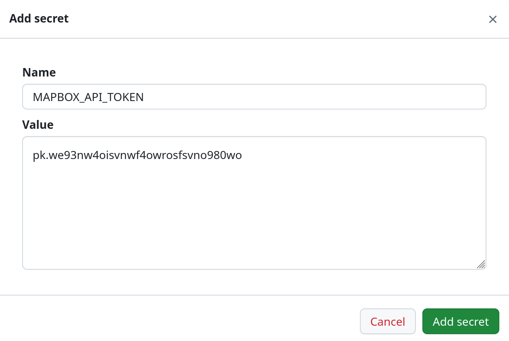
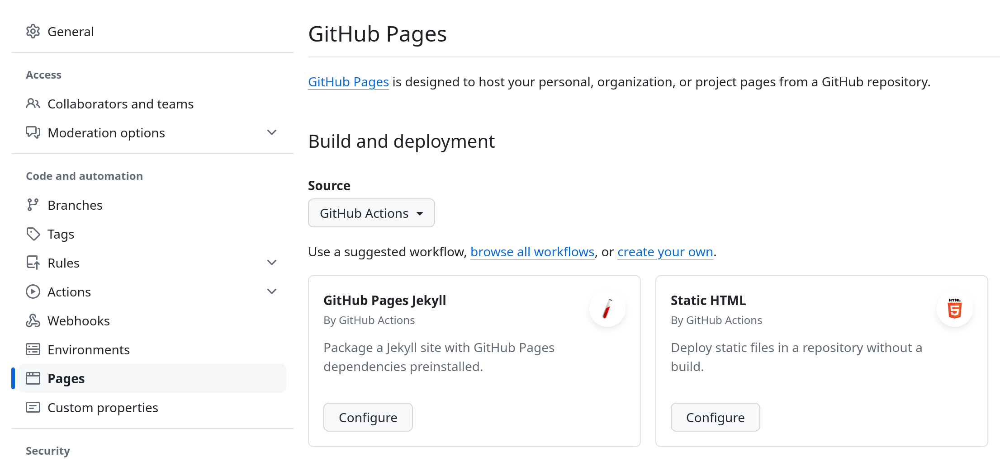

# Leaflet Asset Map

> Adapted from [HandsOnDataViz/leaflet-map-csv](https://github.com/HandsOnDataViz/leaflet-map-csv). See [Credits](#credits) for more information.

Build a simple asset map using Leaflet.



## Demo

https://healthyregions.github.io/leaflet-asset-map/example.html

We have loaded this example with some helpful pieces that you can incorporate back into your `index.html` file.

- Two different basemap styles (more possibilities at https://leaflet-extras.github.io/leaflet-providers/preview/)
    - Keep in mind, some basemap providers will require that you create an API key and include it in the layer definition.
- A second asset layer from a GeoJSON source.
- A layer switcher control with two basemaps and two overlays.
- A plugin for easy access to icons in your map markers.

## Make your own

1. Press **Use this template** button to create a copy of this repository in your own GitHub account.
2. Upload your own CSV or GeoJSON file to the data directory.
    - Make sure your CSV has columns that hold Latitude and Longitude values for each feature.
3. Follow the examples in [example.html](./example.html) to add your own layers to the main map in `index.html`.

For more information on customization, see [Leaflet documentation](https://leafletjs.com/).

For valid icon names, see [ionic.io/ionicons/v2](https://ionic.io/ionicons/v2). Click an icon, and use the name you see _without_ including the `ion-` prefix.

## Adding API Keys

You may need to add API keys (sometimes called "API tokens") to your map in order to access certain map services. It is best practice that you keep these keys _out_ of version control, so that they are not publicly visible in this repository. The following steps will achieve this for simple Github Pages implementations.

> Your API keys won't be _completely_ secret, people could find them by digging into your published web map, but it's most important that they are not stored in Github.

### 1. Set the API Key as a secret in your repo

- Go to **Settings** > **Secrets and variables** > **Actions**
- In the **Secrets** tab click **Manage Environment Secrets**
- Select the **github-pages** environment.
- Scroll down and choose **Add environment secret**
- In the box that appears, enter the name of your variable. Format the variable name like `MAPBOX_API_TOKEN`, and then paste your key into the value section.
    
- Click **Add secret**.

This API key value will now be accessible during the build process for Github Pages, so now we'll configure that build process.

### 2. Configure Github Pages using the Static HTML workflow

_If you have already configured Github Pages using the classic build method, no problem, just follow these steps to change to Github Actions._

- In **Settings** > **Pages** set the **Source** dropdown to **Github Actions**
- Choose the **Static HTML** option and click **Configure**
    
- Don't make any changes to the code you see yet, just click **Commit Changes**

You will now have the following file in your repo: `.github/workflows/static.yml`. In the next step we'll edit this file.

### 3. Write a `secrets.js` file during the build process

Find `.github/workflows/static.yml` and begin editing it. You'll notice the final chunk is called `steps:` and it lists the steps that are taken by the workflow to turn your repo into a published website (it's mostly just copying files). We'll add a new step in the middle that writes our secret into a new file.

- Find the first steps, called "Checkout" and "Setup Pages". Between these two, insert a new one that looks like this.
    ```
    - name: Write secrets file
      run: echo "const mapboxToken = '${{ secrets.MAPBOX_API_TOKEN }}';" > secrets.js
    ```
- The first three steps in the workflow should now look like this:
    ```
    - name: Checkout
      uses: actions/checkout@v4
    - name: Write secrets file
      run: echo "const mapboxToken = '${{ secrets.MAPBOX_API_TOKEN }}';" > secrets.js
    - name: Setup Pages
      uses: actions/configure-pages@v5
    ```
    Make sure to match the indents of the existing content!
- Click **Commit changes** to save.

What is happening here? The command

```
echo "const mapboxToken = '${{ secrets.MAPBOX_API_TOKEN }}';" > secrets.js
```

will write a line of text to a file called `secrets.js`. That line defines a variable called `mapboxToken` in JavaScript, and includes `${{ secrets.MAPBOX_API_TOKEN }}` which is the Github Actions way of looking within your repository secrets and finding the `MAPBOX_API_TOKEN` that we defined earlier.

### 4. Load the `secrets.js` script in your app

Finally, all we need to do is load this new file into our HTML.

- Find your `index.html` file, and begin editing it.
- Somewhere within the head section (i.e. after the opening `<head>` tag and before the closing `</head>` tag) add this line:
    ```
    <script src="./secrets.js"></script>
    ```

That's it! Now, within any JavaScript that comes _after_ this new line, you'll be able to use the variable `mapboxToken` whenever you need to plugin the API Key. Exactly how and where you use that token may depend on the service you are using.

## 5. Using secrets locally

If you are working on this map locally on your computer or laptop, you'll need to replicate the `secrets.js` file that is generated by the Github Action above.

- Create a file called `.gitignore` (if you don't have one already) at the root of your repository
- Put a line in that file that just says `secrets.js`
    - This ensures that the file we create next will never be committed to your repository.
- Now, create a file called `secrets.js` at the root of your repository, and put the following line in it:
    ```
    const mapboxToken = '<your mapbox token>';
    ```
    but insert your real token. It will look something like
    ```
    const mapboxToken = 'pk.eyJ1IjoiY2Rpc2NlbnphIiwiYSI6ImNs1rd20xZ3U1ZHgifQ5ign8f';
    ```

That's it! You should now be able to double-click the `index.html` file in your local file explorer to open it in a browser and see your map.

## Credits

Original template and tutorial by Jack Dougherty and Ilya Ilyankou, see [handsondataviz.org/leaflet-maps-with-csv.html](https://handsondataviz.org/leaflet-maps-with-csv.html), updated by Adam Cox at Healthy Regions & Policies Lab.

## See other Leaflet templates from HandsOnDataViz
* [Simple Leaflet map](https://github.com/HandsOnDataViz/leaflet-map-simple)
* [Leaflet map with open data APIs](https://github.com/HandsOnDataViz/leaflet-maps-open-data-apis)
* [Leaflet map with data from Socrata](https://github.com/HandsOnDataViz/leaflet-socrata)
* [Leaflet polygon map with tabs](https://github.com/HandsOnDataViz/leaflet-map-polygon-tabs)
* [Leaflet heatmap](https://github.com/HandsOnDataViz/leaflet-heatmap)
* [Searcheable Map Template](https://github.com/HandsOnDataViz/searchable-map-template-csv)
* [Leaflet Maps with Google Sheets](https://github.com/HandsOnDataViz/leaflet-maps-with-google-sheets)
* [Leaflet Storymaps with Google Sheets](https://github.com/HandsOnDataViz/leaflet-storymaps-with-google-sheets)
